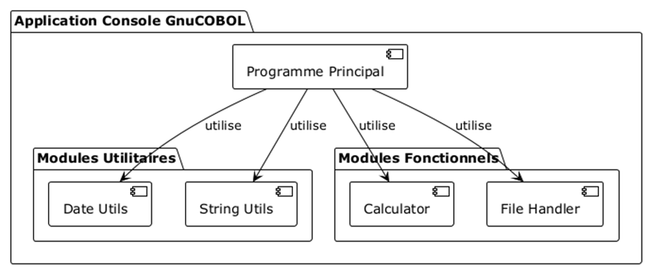
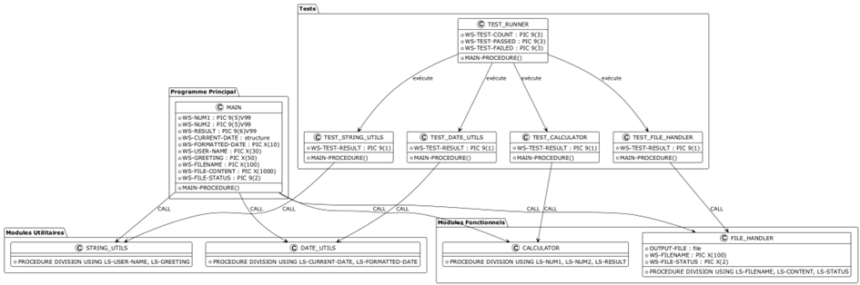

# Application Console GnuCOBOL

Ce projet est une application console développée en GnuCOBOL qui démontre l'utilisation de modules réutilisables et une architecture modulaire. L'application permet d'effectuer des opérations simples comme le formatage de dates, la manipulation de chaînes de caractères, des calculs arithmétiques et l'écriture de fichiers.


## Table des matières

- [Fonctionnalités](#fonctionnalités)
- [Architecture](#architecture)
- [Prérequis](#prérequis)
- [Installation](#installation)
- [Compilation](#compilation)
- [Exécution](#exécution)
- [Tests](#tests)
- [Structure du projet](#structure-du-projet)
- [Génération des diagrammes](#génération-des-diagrammes)
- [Détails sur les modules](#détails-sur-les-modules)
- [Détails sur les tests](#détails-sur-les-tests)
- [Bonnes pratiques de développement COBOL](#bonnes-pratiques-de-développement-cobol)
- [Intégration avec d'autres systèmes](#intégration-avec-dautres-systèmes)
- [Dépannage](#dépannage)
- [Contribuer](#contribuer)
- [Licence](#licence)

## Fonctionnalités

L'application offre les fonctionnalités suivantes :

- **Formatage de dates** : Conversion d'une date au format AAAAMMJJ en format JJ/MM/AAAA
- **Manipulation de chaînes** : Génération de messages de salutation personnalisés
- **Calculs arithmétiques** : Addition de deux nombres
- **Gestion de fichiers** : Écriture de résultats dans un fichier texte

## Architecture

L'application est structurée selon une architecture modulaire, avec des composants réutilisables organisés en modules et utilitaires.

### Diagramme de composants



L'application est divisée en plusieurs composants :
- **Programme principal** : Coordonne l'utilisation des différents modules
- **Modules utilitaires** : Fournissent des fonctionnalités de base (date_utils, string_utils)
- **Modules fonctionnels** : Implémentent des fonctionnalités métier (calculator, file_handler)

### Diagramme de structure



## Prérequis

- GnuCOBOL 3.1 ou supérieur
- CMake 3.10 ou supérieur
- Compilateur C (GCC recommandé)
- Ninja (optionnel, pour une compilation plus rapide)

## Installation

### Installation des dépendances sous Ubuntu/Debian

```bash
sudo apt update
sudo apt install -y build-essential cmake ninja-build gnucobol
```

### Installation des dépendances sous Windows avec WSL

1. Installez WSL (Windows Subsystem for Linux) avec Ubuntu
2. Ouvrez un terminal WSL
3. Exécutez les commandes d'installation pour Ubuntu/Debian ci-dessus

## Compilation

Le projet utilise CMake comme système de build. Pour compiler le projet :

```bash
# Créer un répertoire de build
mkdir -p build
cd build

# Configurer le projet avec CMake
cmake ..

# Compiler le projet
cmake --build .
```

## Exécution

Après la compilation, vous pouvez exécuter l'application de plusieurs façons :

### Utilisation du script d'exécution

```bash
./run_app.sh
```

Ce script configure automatiquement les variables d'environnement nécessaires et exécute l'application.

### Exécution manuelle

```bash
export COB_LIBRARY_PATH=$(pwd)
./cobol_app_exe
```

## Tests

Le projet inclut une suite de tests unitaires pour vérifier le bon fonctionnement des modules.

### Exécution de tous les tests

```bash
# Utilisation du script de tests
./run_tests.sh

# Ou avec CTest
ctest
```

### Exécution d'un test spécifique

```bash
# Exécution directe d'un test
./test_date_utils
./test_string_utils
./test_calculator
./test_file_handler

# Ou avec CTest
ctest -R date_utils
```

### Rapport de tests

Le script `run_tests.sh` exécute tous les tests et génère un rapport global indiquant :
- Le nombre total de tests exécutés
- Le nombre de tests réussis
- Le nombre de tests échoués

## Structure du projet

```
gnucobol-app/
├── CMakeLists.txt              # Fichier CMake principal
├── cmake/
│   └── CobolFunctions.cmake    # Fonctions CMake pour la compilation COBOL
├── docs/
│   ├── images/                 # Images générées à partir des diagrammes PlantUML
│   └── puml/                   # Fichiers source PlantUML
├── include/
│   ├── modules/
│   │   ├── calculator.cpy      # En-têtes pour le module calculator
│   │   └── file_handler.cpy    # En-têtes pour le module file_handler
│   └── utils/
│       ├── date_utils.cpy      # En-têtes pour l'utilitaire date_utils
│       └── string_utils.cpy    # En-têtes pour l'utilitaire string_utils
├── src/
│   ├── CMakeLists.txt          # Configuration CMake pour les sources
│   ├── main.cbl                # Programme principal
│   ├── modules/
│   │   ├── CMakeLists.txt      # Configuration CMake pour les modules
│   │   ├── calculator.cbl      # Module de calcul
│   │   └── file_handler.cbl    # Module de gestion de fichiers
│   └── utils/
│       ├── CMakeLists.txt      # Configuration CMake pour les utilitaires
│       ├── date_utils.cbl      # Utilitaire de formatage de dates
│       └── string_utils.cbl    # Utilitaire de manipulation de chaînes
└── tests/
    ├── CMakeLists.txt          # Configuration CMake pour les tests
    ├── test_runner.cbl         # Exécuteur de tests
    ├── modules/
    │   ├── CMakeLists.txt      # Configuration CMake pour les tests de modules
    │   ├── test_calculator.cbl # Tests pour le module calculator
    │   └── test_file_handler.cbl # Tests pour le module file_handler
    └── utils/
        ├── CMakeLists.txt      # Configuration CMake pour les tests d'utilitaires
        ├── test_date_utils.cbl # Tests pour l'utilitaire date_utils
        └── test_string_utils.cbl # Tests pour l'utilitaire string_utils
```

## Génération des diagrammes

Pour générer les images à partir des fichiers PlantUML, vous pouvez utiliser la commande suivante :

```bash
# Créer le répertoire pour les images
mkdir -p docs/images

# Générer les images à partir des fichiers PlantUML
for file in docs/puml/*.puml; do
  output_file="docs/images/$(basename ${file%.puml}).png"
  plantuml -tpng $file -o ../images
done
```

Vous aurez besoin d'installer PlantUML pour exécuter cette commande :

```bash
# Sur Ubuntu/Debian
sudo apt install -y plantuml

# Ou avec Java
# Télécharger plantuml.jar depuis http://plantuml.com/download
# Puis exécuter :
# java -jar plantuml.jar docs/puml/*.puml -o docs/images
```

## Détails sur les modules

### Module date_utils

Ce module permet de formater une date du format AAAAMMJJ vers le format JJ/MM/AAAA. Il prend en entrée une structure de date contenant l'année, le mois et le jour, et retourne une chaîne formatée.

### Module string_utils

Ce module génère un message de salutation personnalisé. Il prend en entrée un nom d'utilisateur et retourne un message de salutation complet.

### Module calculator

Ce module effectue une addition simple entre deux nombres. Il prend en entrée deux nombres et retourne leur somme.

### Module file_handler

Ce module gère l'écriture de données dans un fichier. Il prend en entrée un nom de fichier et un contenu, et écrit le contenu dans le fichier spécifié. Il retourne un code d'état indiquant si l'opération a réussi.

## Détails sur les tests

### Test date_utils

Ce test vérifie que le module date_utils formate correctement une date. Il définit une date de test (15/05/2023) et vérifie que le résultat du formatage correspond à la valeur attendue.

### Test string_utils

Ce test vérifie que le module string_utils génère correctement un message de salutation. Il définit un nom d'utilisateur ("Jean") et vérifie que le message généré correspond à la valeur attendue ("Bonjour, Jean !").

### Test calculator

Ce test vérifie que le module calculator additionne correctement deux nombres. Il définit deux nombres (123.45 et 67.89) et vérifie que leur somme calculée correspond à la valeur attendue (191.34).

### Test file_handler

Ce test vérifie que le module file_handler écrit correctement un contenu dans un fichier. Il définit un nom de fichier et un contenu, appelle le module pour écrire le fichier, puis vérifie que le fichier a été créé et que son contenu correspond à la valeur attendue.

## Bonnes pratiques de développement COBOL

Ce projet suit plusieurs bonnes pratiques de développement COBOL :

1. **Modularité** : Le code est organisé en modules réutilisables avec des responsabilités bien définies.
2. **Tests unitaires** : Chaque module dispose de tests unitaires pour vérifier son bon fonctionnement.
3. **Gestion des erreurs** : Les modules retournent des codes d'état pour indiquer le succès ou l'échec des opérations.
4. **Documentation** : Le code est bien documenté avec des commentaires explicatifs.
5. **Nommage cohérent** : Les variables et les modules suivent une convention de nommage cohérente.
6. **Séparation des préoccupations** : Les fonctionnalités sont séparées en modules distincts selon leur responsabilité.

## Intégration avec d'autres systèmes

Cette application peut être intégrée avec d'autres systèmes de plusieurs façons :

1. **Fichiers de données** : L'application peut lire et écrire des fichiers qui peuvent être utilisés par d'autres systèmes.
2. **Appels système** : L'application peut être étendue pour effectuer des appels système ou exécuter des commandes shell.
3. **Bases de données** : GnuCOBOL peut être configuré pour interagir avec des bases de données via des extensions.
4. **Services web** : GnuCOBOL peut être étendu pour consommer ou exposer des services web.

## Dépannage

### Problèmes de chargement des modules

Si vous rencontrez des erreurs du type "module 'XXX' not found", assurez-vous que :
1. La variable d'environnement `COB_LIBRARY_PATH` est correctement définie
2. Les liens symboliques pour les modules sont créés (ils sont normalement créés automatiquement)

Vous pouvez créer manuellement les liens symboliques avec :

```bash
cd build
ln -sf libstring_utils.so STRING_UTILS.so
ln -sf libdate_utils.so DATE_UTILS.so
ln -sf libcalculator.so CALCULATOR.so
ln -sf libfile_handler.so FILE_HANDLER.so
```

### Problèmes de compilation

Si vous rencontrez des erreurs lors de la compilation, vérifiez que :
1. GnuCOBOL est correctement installé
2. Les fichiers source COBOL sont correctement formatés (attention aux colonnes en COBOL)
3. Les dépendances sont correctement définies dans les fichiers CMakeLists.txt

## Contribuer

Les contributions sont les bienvenues ! Pour contribuer :
1. Forkez le projet
2. Créez une branche pour votre fonctionnalité (`git checkout -b feature/amazing-feature`)
3. Committez vos changements (`git commit -m 'Add some amazing feature'`)
4. Poussez vers la branche (`git push origin feature/amazing-feature`)
5. Ouvrez une Pull Request

## Licence

Ce projet est sous licence MIT. Voir le fichier LICENSE pour plus de détails.